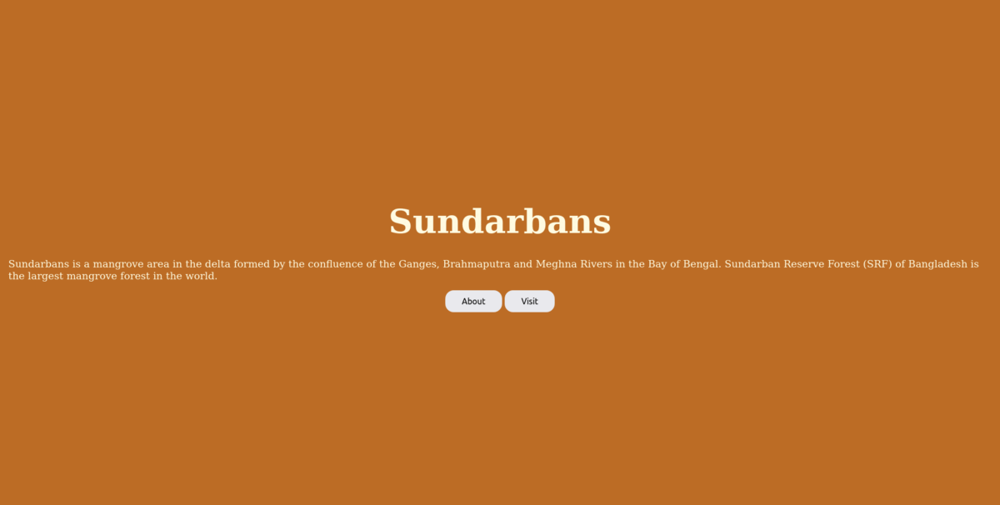

# Basic-Infromation-Site

Information about world largest mangrove forest.

## Table of Contents

- [General Info](#general-information)
- [Technologies Used](#technologies-used)
- [Features](#features)
- [Screenshots](#screenshots)
- [Setup](#setup)
- [Project Status](#project-status)
- [Contact](#contact)

## General Information

This is a encyclopedia type website here you will get the infromation about Sundarban.It is world largest mangrove forest.It contains with 3 others page -

- About page
- Visit page
- 404 Page

## Technologies Used

- Nodejs
- Html

## Screenshots

## Setup

Start with clone the project from github.Then open your terminal or cmd and type:

`npm install`

It will install all the required package to run this project.Then type:

`npm start`

It will start the project on http://localhost:8000/ .Got to any browser ,type
this link and visit.

## Project Status

Project is: _complete_

## Contact

Created by [@ZTanvir](https://github.com/ZTanvir) - feel free to contact me!
